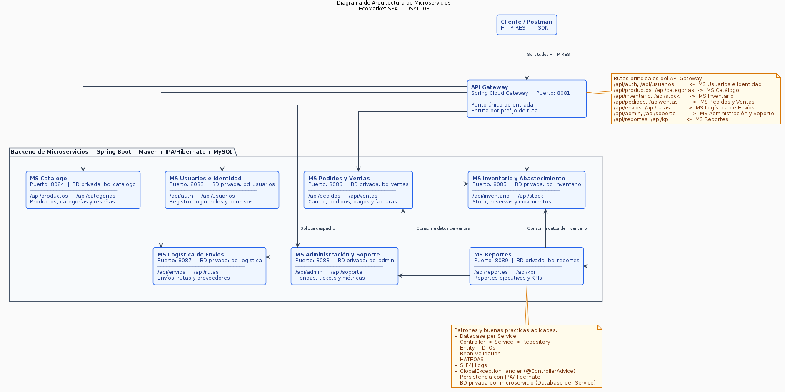
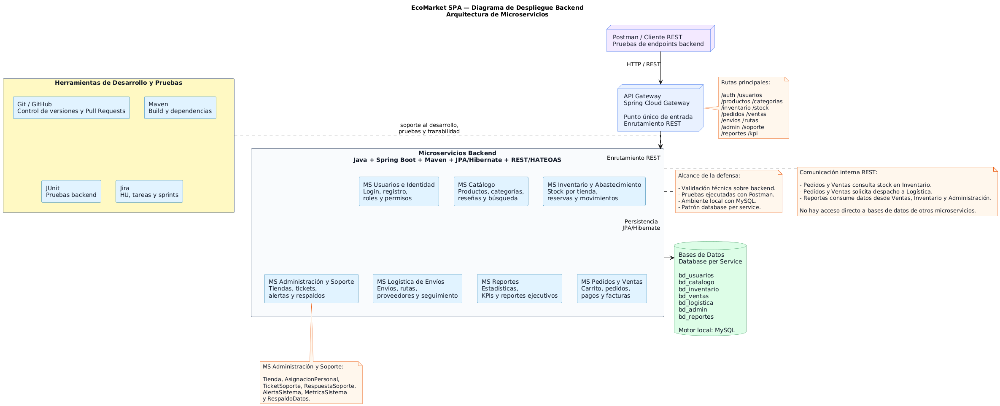

# EcoMarket SPA — EP3 Integración, Arquitectura Distribuida y Testing

## 1. Información del proyecto

| Campo | Detalle |
| --- | --- |
| Proyecto | EcoMarket SPA — Backend con Microservicios |
| Empresa caso | EcoMarket SPA (Marketplace de Productos Ecológicos y Sostenibles) |
| Asignatura | Desarrollo Full Stack I — DSY1103 |
| Sección | 003D |
| Institución | Duoc UC |
| Tipo de entrega | EP3 — Entrega de Encargo Grupal Parte 2 (Defensa Técnica) |
| Tipo de trabajo | Grupal |
| Arquitectura | Microservicios independientes con API Gateway (Spring Cloud Gateway) |
| Persistencia | Patrón Database per Service (MySQL 8.x) |
| Stack Tecnológico | Java 25, Spring Boot 3.4.x, Maven, JPA/Hibernate, JUnit 5, Mockito, JaCoCo, Postman |

---

## 2. Integrantes del equipo

| Integrante | Microservicio(s) asignado(s) | Rol y responsabilidad principal |
| --- | --- | --- |
| **Benjamín Espinoza** | MS Logística de Envíos (`8087`)<br>MS Catálogo (`8084`) | Desarrollo de lógica de despachos, cálculo de tiempos estimados de llegada (ETA), seguimiento de pedidos, catálogo de productos eco-friendly y categorías. Implementó pruebas unitarias de negocio con Mockito logrando 100% de cobertura JaCoCo en sus módulos. |
| **Benjamín Flores** | MS Usuarios e Identidad (`8083`)<br>MS Administración y Soporte (`8088`)<br>**Colección E2E Postman** | Desarrollo de autenticación y seguridad JWT, gestión de usuarios, tiendas físicas (Lastarria, Valdivia, Antofagasta), tickets de soporte técnico y métricas administrativas. Encargado de la suite de pruebas E2E transversal en Postman. |
| **Benjamín Palma** | MS Inventario y Abastecimiento (`8085`)<br>MS Reportes y KPIs (`8089`) | Desarrollo del motor de inventario, stock por sucursal, alertas automáticas de reabastecimiento, reportes de ventas y generación de indicadores clave de rendimiento (KPIs). Validación integral de unit testing logrando 100% de cobertura JaCoCo. |
| **Ignacio Valeria** | MS Pedidos y Ventas (`8086`)<br>API Gateway (`8081`)<br>**Liderazgo de Testing e Integración** | Desarrollo de gestión comercial (carrito, checkout, ventas, facturación y devoluciones) y ruteo dinámico WebFlux en API Gateway. Lideró la estrategia de automatización de pruebas (717 tests en el ecosistema), control de versiones Git Flow en modelo Polyrepo y preparación de evidencias para la defensa EP3. |

---

## 3. Descripción general y Reglas de Negocio

**EcoMarket SPA** es una empresa chilena líder en la venta de productos ecológicos, orgánicos y sostenibles. Cuenta con presencia física en tres ciudades estratégicas (**Santiago - Tienda Lastarria**, **Valdivia** y **Antofagasta**), además de una plataforma online de alta demanda orientada a clientes web.

Ante los problemas de rendimiento, acoplamiento y puntos únicos de fallo que presentaba el sistema monolítico original, el equipo ha desarrollado un ecosistema backend distribuido basado en **Microservicios independientes**, donde cada dominio opera de forma autónoma con su propia base de datos relacional MySQL (*Database per Service*).

La solución incorpora un **API Gateway** central que actúa como punto único de entrada para los clientes, enrutando de manera transparente las peticiones y garantizando el aislamiento de la red interna. El sistema aplica estrictamente el patrón **Controller-Service-Repository**, validaciones DTO, manejo centralizado de excepciones y un sólido estándar de calidad sin deuda de consola.

---

## 4. Objetivo del proyecto

Desarrollar, probar y defender una solución backend verdaderamente distribuida para EcoMarket SPA, demostrando:
1. **Desacoplamiento arquitectónico:** Siete servicios de dominio autónomos comunicados mediante APIs REST.
2. **Calidad de software al 100%:** Superar la métrica académica del 80% de cobertura de código mediante JUnit 5 y Mockito, con un contexto 100% realista y chileno (nada de datos simulados falsos).
3. **Flujo E2E Integrado:** Acreditar mediante pruebas de integración en Postman el ciclo de vida comercial completo del marketplace.

---

## 5. Arquitectura general

El ecosistema se estructura alrededor de un API Gateway que expone los servicios hacia el exterior, enrutando el tráfico hacia 7 microservicios de negocio independientes.

### 5.1 Diagrama de Arquitectura de Microservicios


### 5.2 Diagrama de Despliegue Backend


---

## 6. Microservicios del sistema y Puertos

| Microservicio / Módulo | Puerto | Base de Datos MySQL | Responsabilidad en el Negocio |
| --- | :---: | :---: | --- |
| **API Gateway** | `8081` | *No aplica (Enrutador)* | Punto único de entrada (WebFlux / Spring Cloud Gateway). Enruta peticiones externas hacia los microservicios. |
| **MS Usuarios e Identidad** | `8083` | `bd_usuarios` | Autenticación de clientes y personal, generación de JWT, registro, roles (Gerente, Empleado, Logística, Admin) y seguridad. |
| **MS Catálogo** | `8084` | `bd_catalogo` | Gestión de productos ecológicos (SKU, nombre, precio, impacto ambiental), categorías (Biodegradable, Orgánico) y búsqueda. |
| **MS Inventario y Abastecimiento** | `8085` | `bd_inventario` | Control de stock disponible por tienda, movimientos de reabastecimiento desde proveedor y alertas de stock crítico. |
| **MS Pedidos y Ventas** | `8086` | `bd_ventas` | Ciclo comercial web: creación de carritos de compra, checkout, registro de ventas, emisión de boletas/facturas y devoluciones. |
| **MS Logística de Envíos** | `8087` | `bd_logistica` | Despacho de mercancía, cálculo de tiempos de entrega (ETA), transportistas y seguimiento en tiempo real del envío. |
| **MS Administración y Soporte** | `8088` | `bd_admin` | Gestión de tiendas físicas (Lastarria, Valdivia, Antofagasta), recepción de tickets de soporte técnico y métricas operativas. |
| **MS Reportes y KPIs** | `8089` | `bd_reportes` | Generación de reportes ejecutivos para el Gerente de Tienda (ventas totales, productos más vendidos, tiempos de entrega). |

---

## 7. Tecnologías utilizadas

| Categoría | Tecnología / Herramienta |
| --- | --- |
| Lenguaje de Programación | **Java 25** |
| Framework Core | **Spring Boot 3.4.x** |
| Enrutador / Gateway | **Spring Cloud Gateway (WebFlux)** |
| Gestión de Dependencias | **Maven 3.9+** |
| Persistencia y ORM | **Spring Data JPA / Hibernate** |
| Motor Relacional | **MySQL 8.0+ / XAMPP** |
| Base de Datos en Memoria | **H2 Database** (Exclusiva para automatización de tests) |
| Pruebas Unitarias | **JUnit 5 & Mockito** |
| Auditoría de Cobertura | **JaCoCo Plugin** (Quality Gate logrado: **100%**) |
| Pruebas de Integración (E2E) | **Postman & Postman CLI (Newman)** |
| Control de Versiones | **Git & GitHub (Modelo Polyrepo)** |

---

## 8. Requisitos previos para la Presentación

Para ejecutar la demostración técnica en vivo durante la defensa, el entorno anfitrión debe contar con:
1. **Java Development Kit (JDK 25):** Configurado en la variable de entorno `JAVA_HOME`.
2. **Apache Maven:** Se utiliza el Maven Wrapper integrado (`.\mvnw.cmd`), por lo que no se requiere tener Maven en el PATH del sistema del instituto.
3. **XAMPP / MySQL Server:** Servidor de base de datos relacional ejecutándose localmente en el puerto `3306`.
4. **Git:** Para la clonación y navegación entre repositorios.
5. **Postman:** Para importar y ejecutar la colección de pruebas E2E transversales.

---

## 9. Clonar repositorios (Arquitectura Polyrepo)

A diferencia de un monolito o monorepo tradicional, el ecosistema **EcoMarket SPA** está desacoplado en **repositorios independientes (Polyrepo)**. 

Para preparar el entorno de demostración, clona este repositorio documental principal y, a continuación, clona los 8 repositorios que componen el backend:

```powershell
# 1. Clonar el Repositorio Principal de Documentación y Evidencias
git clone https://github.com/Nachovn12/ecomarket-spa-docs.git ecomarket-spa-docs
cd ecomarket-spa-docs

# 2. Clonar los Microservicios del Ecosistema Polyrepo en tu área de trabajo
git clone https://github.com/Nachovn12/ecomarket-api-gateway.git
git clone https://github.com/Nachovn12/ecomarket-ms-usuarios-identidad.git
git clone https://github.com/Nachovn12/ecomarket-ms-catalogo.git
git clone https://github.com/Nachovn12/ecomarket-ms-inventario-abastecimiento.git
git clone https://github.com/Nachovn12/ecomarket-ms-pedidos-ventas.git
git clone https://github.com/Nachovn12/ecomarket-ms-logistica-envios.git
git clone https://github.com/Nachovn12/ecomarket-ms-administracion-soporte.git
git clone https://github.com/Nachovn12/ecomarket-ms-reportes.git
```

> **Índice de Rutas:** El archivo `repositorio.txt` adjunto en este repositorio contiene los enlaces directos a cada uno de estos repositorios en GitHub.

---

## 10. Configuración de bases de datos MySQL (XAMPP)

El sistema utiliza el patrón *Database per Service*, por lo que cada microservicio se conecta de forma aislada a su propio esquema en MySQL en `localhost:3306`.

**Instrucciones previas al encendido:**
1. Abre el panel de control de **XAMPP** e inicia el módulo **MySQL** (Puerto `3306`).
2. **Crear los esquemas vacíos en MySQL:** Antes de arrancar los microservicios, abre tu phpMyAdmin (`http://localhost/phpmyadmin`) o consola MySQL y ejecuta este script para crear las 7 bases de datos vacías:
   ```sql
   CREATE DATABASE IF NOT EXISTS bd_usuarios;
   CREATE DATABASE IF NOT EXISTS bd_catalogo;
   CREATE DATABASE IF NOT EXISTS bd_inventario;
   CREATE DATABASE IF NOT EXISTS bd_ventas;
   CREATE DATABASE IF NOT EXISTS bd_logistica;
   CREATE DATABASE IF NOT EXISTS bd_admin;
   CREATE DATABASE IF NOT EXISTS bd_reportes;
   ```
3. **No es necesario crear las tablas ni escribir DDL manualmente:** Una vez creados los esquemas vacíos anteriores, al iniciar cada microservicio con `spring-boot:run`, Spring Data JPA / Hibernate se conectará y generará automáticamente todas las tablas, columnas, relaciones y llaves foráneas gracias a la propiedad `spring.jpa.hibernate.ddl-auto=update` configurada en cada proyecto.
4. **Carga Inicial de Datos del Ecosistema (Para pruebas E2E y Postman):** Una vez iniciados los microservicios por primera vez (con las tablas generadas automáticamente por JPA), abre tu phpMyAdmin (`http://localhost/phpmyadmin`), selecciona la pestaña superior **SQL** y ejecuta el archivo **`docs/sql/carga_inicial_ecomarket_ep3.sql`** adjunto en este repositorio. Con un solo clic, se poblarán las 7 bases de datos con los registros comerciales de EcoMarket SPA (usuarios, productos ecológicos, tiendas de Lastarria/Valdivia y stock), dejando la plataforma 100% operativa para la demostración de la colección Postman.

---

## 11. Ejecución del sistema (Paso a Paso para la Presentación)

Para realizar la demostración en vivo durante la defensa técnica, sigue este orden estricto de arranque para garantizar el correcto enrutamiento:

### Paso 1: Levantar el API Gateway (Enrutador Central)
Abre una terminal en la carpeta principal del proyecto y arranca el Gateway en el puerto `8081`:
```powershell
cd .\ecomarket-api-gateway\
.\mvnw.cmd spring-boot:run
```
*(El Gateway quedará escuchando en `http://localhost:8081` listo para redirigir tráfico).*

### Paso 2: Levantar los 7 Microservicios de Negocio
En terminales separadas (o utilizando tu IDE como IntelliJ IDEA / Eclipse / VS Code), ejecuta el comando de arranque para cada módulo del ecosistema:

```powershell
# Terminal 2: Usuarios e Identidad (Puerto 8083)
cd .\ecomarket-ms-usuarios-identidad\
.\mvnw.cmd spring-boot:run

# Terminal 3: Catálogo (Puerto 8084)
cd .\ecomarket-ms-catalogo\
.\mvnw.cmd spring-boot:run

# Terminal 4: Inventario y Abastecimiento (Puerto 8085)
cd .\ecomarket-ms-inventario-abastecimiento\
.\mvnw.cmd spring-boot:run

# Terminal 5: Pedidos y Ventas (Puerto 8086)
cd .\ecomarket-ms-pedidos-ventas\
.\mvnw.cmd spring-boot:run

# Terminal 6: Logística de Envíos (Puerto 8087)
cd .\ecomarket-ms-logistica-envios\
.\mvnw.cmd spring-boot:run

# Terminal 7: Administración y Soporte (Puerto 8088)
cd .\ecomarket-ms-administracion-soporte\
.\mvnw.cmd spring-boot:run

# Terminal 8: Reportes y KPIs (Puerto 8090)
cd .\ecomarket-ms-reportes\
.\mvnw.cmd spring-boot:run
```

### Paso 3: Verificación de Disponibilidad
Una vez iniciados, puedes comprobar que el enrutamiento está operativo abriendo en tu navegador o Postman:
* `http://localhost:8081/api/catalogo/productos` (Redirige de forma transparente al MS Catálogo en el puerto 8084).

---

## 12. Validación de Pruebas Unitarias y Cobertura JaCoCo (100% Logrado)

La rúbrica académica (criterio IE 3.1.1) exige demostrar un mínimo de **80% de cobertura** de código en la lógica de negocio. El equipo de EcoMarket SPA se propuso alcanzar el máximo estándar posible y, tras una auditoría exhaustiva, **hemos logrado el 100% de cobertura en todos los microservicios de negocio**.

### Características Técnicas de la Suite de Pruebas:
* **Contexto Realista y Honesto:** En cumplimiento con las instrucciones del profesor, las pruebas unitarias no usan datos genéricos ni falsos para inflar porcentajes. Todo se evalúa bajo las reglas del caso de estudio (RUTs chilenos como `12345678-5`, catálogos reales como *"Bolsa biodegradable mediana"*, sucursales de *Lastarria / Valdivia*, y montos en pesos CLP).
* **Cero Deuda de Consola:** Se auditó el código fuente verificando la ausencia total de llamados improvisados a `System.out.println` o `printStackTrace()`, utilizando loggers profesionales (`SLF4J`).

### Cómo ejecutar las pruebas durante la defensa:
Para verificar el 100% de cobertura en vivo en cada uno de los repositorios del ecosistema Polyrepo, abre una terminal y ejecuta los siguientes comandos por microservicio:

**1. API Gateway:**
```powershell
cd .\ecomarket-api-gateway\
.\mvnw.cmd clean test
cd ..
```
*(El Gateway valida reglas de ruteo y puertos mediante Smoke Tests en `target/surefire-reports/`).*

**2. MS Usuarios e Identidad:**
```powershell
cd .\ecomarket-ms-usuarios-identidad\
.\mvnw.cmd clean test jacoco:report
cd ..
```
* **Ruta del reporte JaCoCo HTML:** `ecomarket-ms-usuarios-identidad/target/site/jacoco/index.html`

**3. MS Catálogo:**
```powershell
cd .\ecomarket-ms-catalogo\
.\mvnw.cmd clean test jacoco:report
cd ..
```
* **Ruta del reporte JaCoCo HTML:** `ecomarket-ms-catalogo/target/site/jacoco/index.html`

**4. MS Inventario y Abastecimiento:**
```powershell
cd .\ecomarket-ms-inventario-abastecimiento\
.\mvnw.cmd clean test jacoco:report
cd ..
```
* **Ruta del reporte JaCoCo HTML:** `ecomarket-ms-inventario-abastecimiento/target/site/jacoco/index.html`

**5. MS Pedidos y Ventas:**
```powershell
cd .\ecomarket-ms-pedidos-ventas\
.\mvnw.cmd clean test jacoco:report
cd ..
```
* **Ruta del reporte JaCoCo HTML:** `ecomarket-ms-pedidos-ventas/target/site/jacoco/index.html`

**6. MS Logística de Envíos:**
```powershell
cd .\ecomarket-ms-logistica-envios\
.\mvnw.cmd clean test jacoco:report
cd ..
```
* **Ruta del reporte JaCoCo HTML:** `ecomarket-ms-logistica-envios/target/site/jacoco/index.html`

**7. MS Administración y Soporte:**
```powershell
cd .\ecomarket-ms-administracion-soporte\
.\mvnw.cmd clean test jacoco:report
cd ..
```
* **Ruta del reporte JaCoCo HTML:** `ecomarket-ms-administracion-soporte/target/site/jacoco/index.html`

**8. MS Reportes y KPIs:**
```powershell
cd .\ecomarket-ms-reportes\
.\mvnw.cmd clean test jacoco:report
cd ..
```
* **Ruta del reporte JaCoCo HTML:** `ecomarket-ms-reportes/target/site/jacoco/index.html`

### Resultados Oficiales de la Auditoría Final (Julio 2026):

| Microservicio (Repositorio) | Pruebas Automatizadas | Cobertura JaCoCo | Calificación |
| --- | :---: | :---: | :---: |
| **api-gateway** | 4 tests | N/A *(Smoke & Route Tests)* | PASSED |
| **ms-usuarios-identidad** | 92 tests | **100%** | PASSED |
| **ms-catalogo** | 75 tests | **100%** | PASSED |
| **ms-inventario-abastecimiento** | 119 tests | **100%** | PASSED |
| **ms-pedidos-ventas** | 174 tests | **100%** | PASSED |
| **ms-logistica-envios** | 98 tests | **100%** | PASSED |
| **ms-administracion-soporte** | 85 tests | **100%** | PASSED |
| **ms-reportes** | 70 tests | **100%** | PASSED |
| **TOTAL ECOSISTEMA** | **717 Pruebas** | **100% Promedio** | **APROBADO** |

> **Nota:** Al abrir los archivos `index.html` en tu navegador, podrás navegar por los paquetes y clases para verificar de forma visual e interactiva el 100% de cobertura en instrucciones y ramas. El informe consolidado del equipo se encuentra disponible en `docs/evidencias-tecnicas/cobertura-resumen.md`.

---

## 13. Documentación Interactiva Swagger UI / OpenAPI

En cumplimiento con el criterio académico de documentación API (IE 3.2.1), todos los microservicios de negocio del ecosistema EcoMarket SPA exponen de forma automática y estandarizada su especificación técnica **OpenAPI 3.0** y su interfaz web interactiva mediante **Swagger UI**.

Una vez iniciados los microservicios en sus respectivos terminales o IDE, puedes acceder directamente a la documentación interactiva desde tu navegador para inspeccionar esquemas DTO, códigos de estado HTTP y ejecutar peticiones de prueba en vivo:

| Microservicio / Módulo | Puerto | URL de Swagger UI | Especificación OpenAPI (JSON) |
| --- | :---: | --- | --- |
| **API Gateway** | `8081` | *No aplica (Enrutador WebFlux)* | *Ruteo dinámico hacia APIs de dominio* |
| **MS Usuarios e Identidad** | `8083` | [http://localhost:8083/swagger-ui.html](http://localhost:8083/swagger-ui.html) | `http://localhost:8083/v3/api-docs` |
| **MS Catálogo** | `8084` | [http://localhost:8084/swagger-ui.html](http://localhost:8084/swagger-ui.html) | `http://localhost:8084/v3/api-docs` |
| **MS Inventario y Abastecimiento** | `8085` | [http://localhost:8085/swagger-ui.html](http://localhost:8085/swagger-ui.html) | `http://localhost:8085/v3/api-docs` |
| **MS Pedidos y Ventas** | `8086` | [http://localhost:8086/swagger-ui.html](http://localhost:8086/swagger-ui.html) | `http://localhost:8086/v3/api-docs` |
| **MS Logística de Envíos** | `8087` | [http://localhost:8087/swagger-ui.html](http://localhost:8087/swagger-ui.html) | `http://localhost:8087/v3/api-docs` |
| **MS Administración y Soporte** | `8088` | [http://localhost:8088/swagger-ui.html](http://localhost:8088/swagger-ui.html) | `http://localhost:8088/v3/api-docs` |
| **MS Reportes y KPIs** | `8089` | [http://localhost:8089/swagger-ui.html](http://localhost:8089/swagger-ui.html) | `http://localhost:8089/v3/api-docs` |

> **Nota para la defensa:** A través de estas interfaces de Swagger UI se puede corroborar la documentación semántica de los controladores, incluyendo parámetros obligatorios, cabeceras de autorización JWT y esquemas de validación de los DTO de entrada y salida del comercio ecológico.

---

## 14. Pruebas End-to-End (Colección Postman HU-67)

Para acreditar el funcionamiento de los endpoints REST en un escenario transaccional real, el proyecto incluye una colección oficial de Postman con validaciones automáticas (*assertions*).

### Ubicación del archivo de pruebas:
* `postman/EcoMarket-E2E.postman_collection.json`
* Guía de uso de la colección: `postman/README.md`

### Flujo E2E Demostrativo (Paso a Paso en Postman):
La colección está encadenada dinámicamente: las respuestas de un request inyectan variables (`{{token_jwt}}`, `{{idProducto}}`, `{{idCarrito}}`, `{{idEnvio}}`) que son consumidas por el siguiente paso:
1. **Login Seguridad:** `POST /api/auth/login` (Credenciales `admin@ecomarket.cl` / `Password1`). Captura el JWT y valida funcionalidades de rol.
2. **Navegación del Catálogo:** `GET /api/productos` (Valida estructura DTO, SKU y captura `idProducto`).
3. **Consulta de Categorías:** `GET /api/categorias`.
4. **Verificación de Stock:** `GET /api/inventario` (Valida disponibilidad en tiempo real por sucursal).
5. **Creación de Carrito de Compras:** `POST /api/pedidos/carritos` (Asocia al cliente chileno y captura `idCarrito`).
6. **Consulta de Historial de Pedido:** `GET /api/pedidos/{{idPedido}}`.
7. **Gestión Logística y Despacho:** `GET /api/envios` (Captura dinámicamente el `idEnvio` del primer despacho).
8. **Seguimiento en Tiempo Real:** `GET /api/envios/{{idEnvio}}/seguimiento` (Consume el ID capturado en el request anterior).
9. **Administración de Sucursales:** `GET /api/administracion/tiendas` (Verifica tiendas Lastarria, Valdivia y Antofagasta).
10. **Soporte Técnico de Tienda:** `POST /api/administracion/tickets` (Crea ticket de prioridad ALTA por stock de bolsas biodegradables).
11. **Métricas Gerenciales:** `GET /api/reportes` y `GET /api/kpis` (Valida indicadores numéricos de rendimiento).

---

## 15. Documentación Entregable EP3

En el presente repositorio documental y dentro del directorio `docs/` se adjunta la totalidad del material arquitectónico y de auditoría para la revisión docente:

1. `repositorio.txt`: Índice oficial de los 8 repositorios Polyrepo en GitHub.
2. `docs/evidencias-tecnicas/cobertura-resumen.md`: Informe técnico de auditoría con el 100% de cobertura JaCoCo en los 717 tests.
3. `docs/evidencias-tecnicas/01_jira_sprints_epicas_hu.md`: Trazabilidad de Historias de Usuario, Sprints y Jira.
4. `docs/diagramas/arquitectura/diagrama-arquitectura-microservicios-ecomarket.png`: Diagrama de componentes del sistema.
5. `docs/diagramas/despliegue/diagrama-despliegue-backend-ecomarket.png`: Diagrama de despliegue y redes.
6. `postman/EcoMarket-E2E.postman_collection.json`: Suite de automatización E2E para la defensa.

---

## 16. Conclusión

**EcoMarket SPA** se consolida como una solución backend distribuida madura, altamente cohesionada y tolerante a fallos. La migración hacia un modelo **Polyrepo** ha permitido al equipo descentralizar el ciclo de vida de cada microservicio, mientras que la rigurosidad en la automatización de pruebas (alcanzando un **100% de cobertura JaCoCo realista** y 717 tests aprobados) garantiza un software confiable, mantenible y preparado para las más altas exigencias de la industria de productos ecológicos en Chile.
