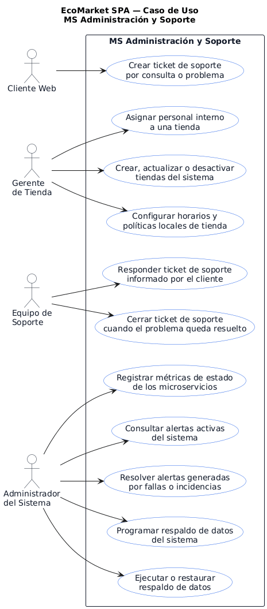
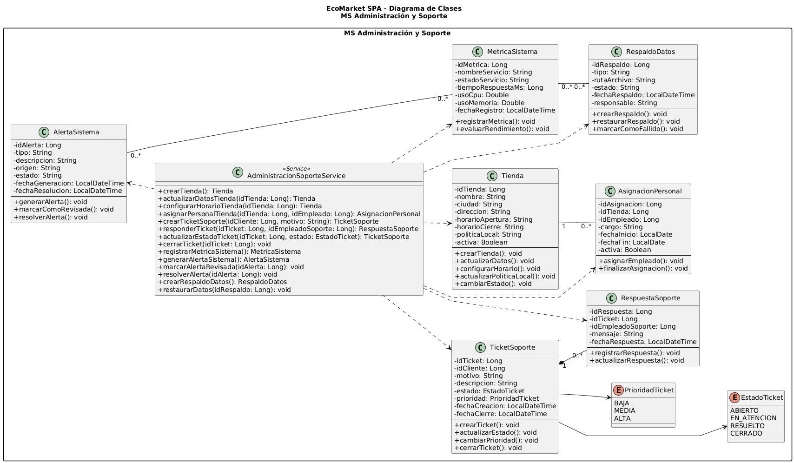

# MS Administracion y Soporte

Microservicio responsable de tiendas, asignacion de personal, tickets de soporte, respuestas, metricas, alertas, respaldos y restauracion de datos de EcoMarket SPA.

## Responsable

| Campo | Detalle |
| --- | --- |
| Responsable principal | Ignacio Valeria |
| Rama de trabajo | `feature/ms-administracion-soporte` |
| Base de datos | `bd_admin` |
| Puerto local | `8088` |
| URL base local | `http://localhost:8088` |

## Que hace

- Crea, consulta y actualiza tiendas.
- Asigna personal interno a tiendas.
- Crea y gestiona tickets de soporte.
- Registra respuestas asociadas a tickets.
- Registra metricas de estado de microservicios.
- Registra, lista y resuelve alertas del sistema.
- Programa, ejecuta y restaura respaldos.
- Expone respuestas REST con validaciones y manejo global de errores.

## Tecnologias

- Java 21
- Spring Boot
- Spring Web
- Spring Data JPA / Hibernate
- Spring HATEOAS
- MySQL
- Maven
- JUnit

## Estructura CSR

- `controller`: expone endpoints REST y respuestas HATEOAS.
- `service`: concentra reglas de negocio y validaciones del dominio.
- `repository`: encapsula el acceso a datos con Spring Data JPA.
- `model`: contiene las clases persistentes JPA (`@Entity`, `@Table`, `@Id`).
- `dto`: define contratos de entrada y salida de la API.

## Configuracion

El archivo principal de configuracion esta en:

```text
src/main/resources/application.properties
```

Valores principales:

```properties
spring.application.name=ms-administracion-soporte
server.port=8088
spring.datasource.url=${ADMIN_DB_URL:jdbc:mysql://localhost:3306/bd_admin?createDatabaseIfNotExist=true&useSSL=false&allowPublicKeyRetrieval=true&serverTimezone=America/Santiago}
spring.datasource.username=${DB_USER:root}
spring.datasource.password=${DB_PASSWORD:}
```

Antes de ejecutar, crear o verificar la base de datos:

```sql
CREATE DATABASE IF NOT EXISTS bd_admin
CHARACTER SET utf8mb4
COLLATE utf8mb4_unicode_ci;
```

## Como ejecutar

Desde la raiz del repositorio:

```powershell
cd .\ms-administracion-soporte\
.\mvnw.cmd spring-boot:run
```

## Como probar

```powershell
.\mvnw.cmd test
```

O desde la raiz:

```powershell
mvn -f ms-administracion-soporte/pom.xml clean test
```

## Endpoints principales

| Metodo | Ruta | Uso |
| --- | --- | --- |
| POST | `/api/admin/tiendas` | Crear tienda |
| GET | `/api/admin/tiendas` | Listar tiendas |
| GET | `/api/admin/tiendas/{idTienda}` | Consultar tienda |
| PUT | `/api/admin/tiendas/{idTienda}` | Actualizar tienda |
| POST | `/api/admin/tiendas/{idTienda}/personal` | Asignar personal |
| GET | `/api/admin/tiendas/{idTienda}/personal` | Listar personal por tienda |
| POST | `/api/soporte/tickets` | Crear ticket |
| GET | `/api/soporte/tickets` | Listar tickets |
| GET | `/api/soporte/tickets/{idTicket}` | Consultar ticket |
| PATCH | `/api/soporte/tickets/{idTicket}/estado` | Actualizar estado de ticket |
| POST | `/api/soporte/tickets/{idTicket}/respuestas` | Responder ticket |
| GET | `/api/soporte/tickets/{idTicket}/respuestas` | Listar respuestas |
| POST | `/api/admin/monitorizacion/metricas` | Registrar metrica |
| GET | `/api/admin/monitorizacion/metricas` | Listar metricas |
| POST | `/api/admin/monitorizacion/alertas` | Registrar alerta |
| GET | `/api/admin/monitorizacion/alertas` | Listar alertas |
| PATCH | `/api/admin/monitorizacion/alertas/{idAlerta}/resolver` | Resolver alerta |
| POST | `/api/admin/respaldos` | Programar respaldo |
| GET | `/api/admin/respaldos` | Listar respaldos |
| PATCH | `/api/admin/respaldos/{idRespaldo}/ejecutar` | Ejecutar respaldo |
| PATCH | `/api/admin/respaldos/{idRespaldo}/restaurar` | Restaurar respaldo |

## Ejemplo de uso

Listar tiendas:

```http
GET http://localhost:8088/api/admin/tiendas
```

Listar tickets:

```http
GET http://localhost:8088/api/soporte/tickets
```

## Diagramas

### Casos de uso



### Diagrama de clases



## Documentacion relacionada

- `../docs/postman/evidencia-s4-ignacio-admin-soporte.md`
- `../docs/evidencias-tecnicas/01_jira_sprints_epicas_hu.md`
- `../docs/evidencias-tecnicas/06_microservicios_arquitectura.md`
- `../docs/evidencias/evidencia-build-tests.md`
- `../docs/arquitectura/bases-datos-mysql.md`
