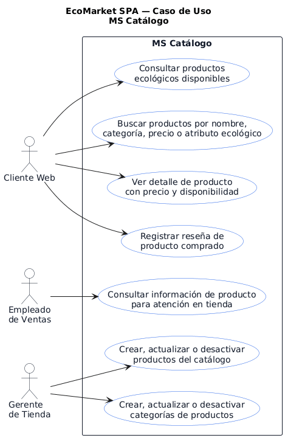
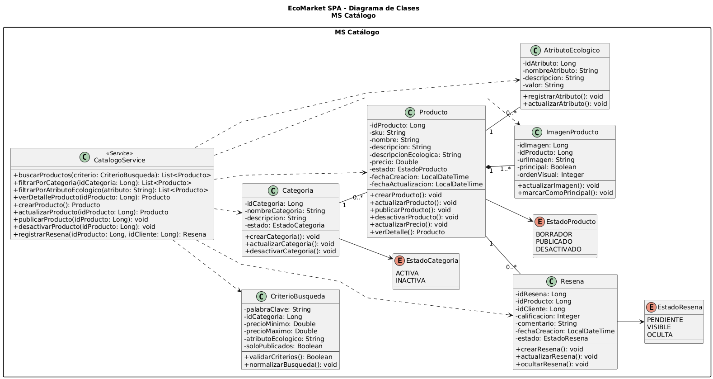

# MS Catalogo

Microservicio responsable de administrar productos ecologicos, categorias, busquedas, atributos ecologicos y resenas de productos dentro de EcoMarket SPA.

## Responsable

| Campo | Detalle |
| --- | --- |
| Responsable principal | Benjamín Espinoza |
| Rama de trabajo | `feature/ms-catalogo` |
| Base de datos | `bd_catalogo` |
| Puerto local | `8084` |
| URL base local | `http://localhost:8084` |

## Que hace

- Crea, lista, consulta, actualiza y elimina productos del catalogo.
- Administra categorias de productos.
- Permite buscar productos por palabra clave, categoria y rango de precio.
- Permite consultar productos por atributo ecologico.
- Registra resenas de productos comprados.
- Expone respuestas REST con validaciones, manejo de errores y enlaces HATEOAS.

## Tecnologias

- Java 21
- Spring Boot
- Spring Web
- Spring Data JPA / Hibernate
- Spring HATEOAS
- MySQL
- Maven
- JUnit

## Estructura CSR

- `controller`: expone endpoints REST y respuestas HATEOAS.
- `service`: concentra reglas de negocio y validaciones del dominio.
- `repository`: encapsula el acceso a datos con Spring Data JPA.
- `model`: contiene las clases persistentes JPA (`@Entity`, `@Table`, `@Id`).
- `dto`: define contratos de entrada y salida de la API.

## Configuracion

El archivo principal de configuracion esta en:

```text
src/main/resources/application.properties
```

Valores principales:

```properties
spring.application.name=ms-catalogo
server.port=8084
spring.datasource.url=${CATALOGO_DB_URL:jdbc:mysql://localhost:3306/bd_catalogo?createDatabaseIfNotExist=true&useSSL=false&allowPublicKeyRetrieval=true&serverTimezone=America/Santiago}
spring.datasource.username=${DB_USER:root}
spring.datasource.password=${DB_PASSWORD:}
```

Antes de ejecutar, crear o verificar la base de datos:

```sql
CREATE DATABASE IF NOT EXISTS bd_catalogo
CHARACTER SET utf8mb4
COLLATE utf8mb4_unicode_ci;
```

## Como ejecutar

Desde la raiz del repositorio:

```powershell
cd .\ms-catalogo\
.\mvnw.cmd spring-boot:run
```

## Como probar

```powershell
.\mvnw.cmd test
```

O desde la raiz:

```powershell
mvn -f ms-catalogo/pom.xml clean test
```

## Endpoints principales

| Metodo | Ruta | Uso |
| --- | --- | --- |
| POST | `/api/productos` | Crear producto |
| GET | `/api/productos` | Listar productos |
| GET | `/api/productos/{id}` | Consultar producto por ID |
| PUT | `/api/productos/{id}` | Actualizar producto |
| DELETE | `/api/productos/{id}` | Eliminar producto |
| GET | `/api/productos/buscar` | Buscar por palabra clave, categoria o precio |
| GET | `/api/productos/ecologicos` | Buscar por atributo ecologico |
| POST | `/api/categorias` | Crear categoria |
| GET | `/api/categorias` | Listar categorias |
| GET | `/api/categorias/{id}` | Consultar categoria |
| PUT | `/api/categorias/{id}` | Actualizar categoria |
| DELETE | `/api/categorias/{id}` | Eliminar categoria |
| POST | `/api/resenas` | Registrar resena |

## Ejemplo de uso

Listar productos:

```http
GET http://localhost:8084/api/productos
```

Buscar productos ecologicos:

```http
GET http://localhost:8084/api/productos/ecologicos?atributoEcologico=biodegradable
```

## Diagramas

### Casos de uso



### Diagrama de clases



## Documentacion relacionada

- `../docs/postman/evidencia-logistica-catalogo-sprint3.md`
- `../docs/evidencias-tecnicas/01d_auditoria_sprint1_codigo_hu_tareas.md`
- `../docs/evidencias-tecnicas/01c_auditoria_sprint2_codigo_hu_tareas.md`
- `../docs/evidencias-tecnicas/01b_auditoria_sprint3_codigo_hu_tareas.md`
- `../docs/arquitectura/bases-datos-mysql.md`
