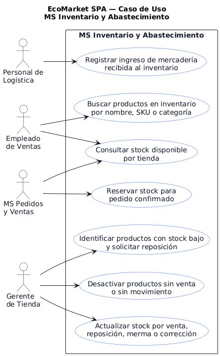
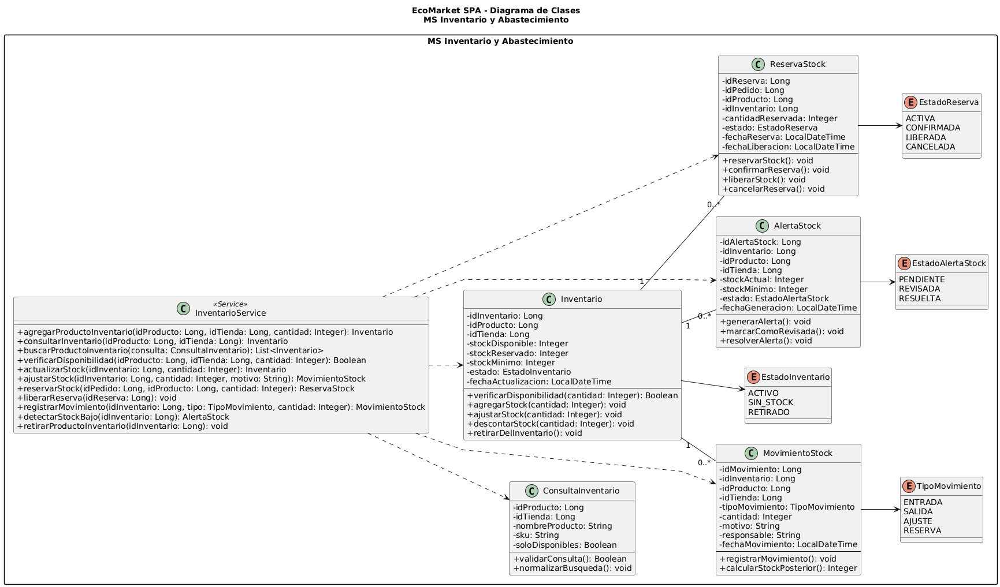

# MS Inventario y Abastecimiento

Microservicio responsable de gestionar productos de inventario, stock por tienda, ajustes, pedidos de reabastecimiento y recepcion de mercancia para EcoMarket SPA.

## Responsable

| Campo | Detalle |
| --- | --- |
| Responsable principal | Benjamín Palma |
| Rama de trabajo | `feature/ms-inventario-abastecimiento` |
| Base de datos | `bd_inventario` |
| Puerto local | `8085` |
| URL base local | `http://localhost:8085` |

## Que hace

- Registra productos disponibles para inventario.
- Consulta stock por producto, SKU, nombre, categoria o sucursal.
- Administra registros de inventario por tienda.
- Realiza ajustes manuales de stock con motivo.
- Gestiona pedidos de reabastecimiento.
- Registra recepciones de mercancia y actualiza stock.
- Expone respuestas REST con validaciones, manejo de errores y enlaces HATEOAS.

## Tecnologias

- Java 21
- Spring Boot
- Spring Web
- Spring Data JPA / Hibernate
- Spring HATEOAS
- MySQL
- Maven
- JUnit

## Estructura CSR

- `controller`: expone endpoints REST y respuestas HATEOAS.
- `service`: concentra reglas de negocio y validaciones del dominio.
- `repository`: encapsula el acceso a datos con Spring Data JPA.
- `model`: contiene las clases persistentes JPA (`@Entity`, `@Table`, `@Id`).
- `dto`: define contratos de entrada y salida de la API.

## Configuracion

El archivo principal de configuracion esta en:

```text
src/main/resources/application.properties
```

Valores principales:

```properties
spring.application.name=ms-inventario-abastecimiento
server.port=8085
spring.datasource.url=${INVENTARIO_DB_URL:jdbc:mysql://localhost:3306/bd_inventario?createDatabaseIfNotExist=true&useSSL=false&allowPublicKeyRetrieval=true&serverTimezone=America/Santiago}
spring.datasource.username=${DB_USER:root}
spring.datasource.password=${DB_PASSWORD:}
```

Antes de ejecutar, crear o verificar la base de datos:

```sql
CREATE DATABASE IF NOT EXISTS bd_inventario
CHARACTER SET utf8mb4
COLLATE utf8mb4_unicode_ci;
```

## Como ejecutar

Desde la raiz del repositorio:

```powershell
cd .\ms-inventario-abastecimiento\
.\mvnw.cmd spring-boot:run
```

## Como probar

```powershell
.\mvnw.cmd test
```

O desde la raiz:

```powershell
mvn -f ms-inventario-abastecimiento/pom.xml clean test
```

## Endpoints principales

| Metodo | Ruta | Uso |
| --- | --- | --- |
| POST | `/api/inventario/productos` | Crear producto de inventario |
| GET | `/api/inventario/productos` | Listar productos |
| GET | `/api/inventario/productos/{id}` | Consultar producto |
| GET | `/api/inventario/productos/sku/{sku}` | Consultar producto por SKU |
| GET | `/api/inventario/productos/buscar/nombre` | Buscar por nombre |
| GET | `/api/inventario/productos/buscar/categoria` | Buscar por categoria |
| GET | `/api/inventario/productos/buscar/sucursal` | Buscar por sucursal |
| PUT | `/api/inventario/productos/{id}` | Actualizar producto |
| DELETE | `/api/inventario/productos/{id}` | Eliminar producto |
| POST | `/api/inventario` | Crear registro de inventario |
| GET | `/api/inventario/{id}` | Consultar inventario |
| PUT | `/api/inventario/{id}/stock` | Actualizar stock |
| POST | `/api/inventario/ajustes-stock` | Registrar ajuste de stock |
| GET | `/api/inventario/ajustes-stock` | Listar ajustes |
| POST | `/api/inventario/pedidos-reabastecimiento` | Crear pedido de reabastecimiento |
| PUT | `/api/inventario/pedidos-reabastecimiento/{id}/aprobar` | Aprobar pedido |
| PUT | `/api/inventario/pedidos-reabastecimiento/{id}/rechazar` | Rechazar pedido |
| POST | `/api/inventario/recepciones-mercancia` | Registrar recepcion de mercancia |

## Ejemplo de uso

Consultar productos:

```http
GET http://localhost:8085/api/inventario/productos
```

Consultar por SKU:

```http
GET http://localhost:8085/api/inventario/productos/sku/ECO-001
```

## Diagramas

### Casos de uso



### Diagrama de clases



## Documentacion relacionada

- `../docs/evidencias-tecnicas/01d_auditoria_sprint1_codigo_hu_tareas.md`
- `../docs/evidencias-tecnicas/01c_auditoria_sprint2_codigo_hu_tareas.md`
- `../docs/evidencias-tecnicas/01b_auditoria_sprint3_codigo_hu_tareas.md`
- `../docs/evidencias/evidencia-build-tests.md`
- `../docs/arquitectura/bases-datos-mysql.md`
