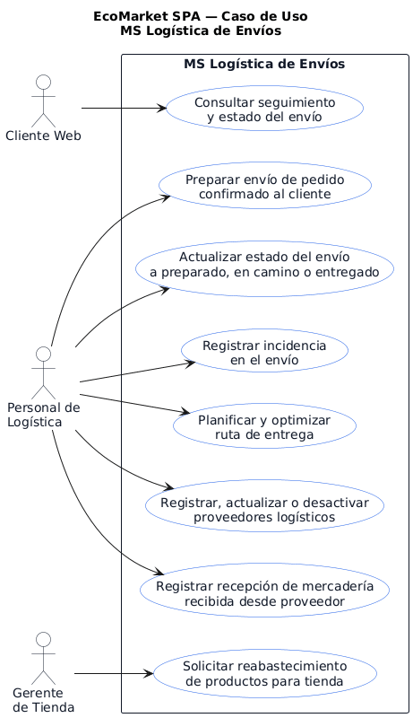
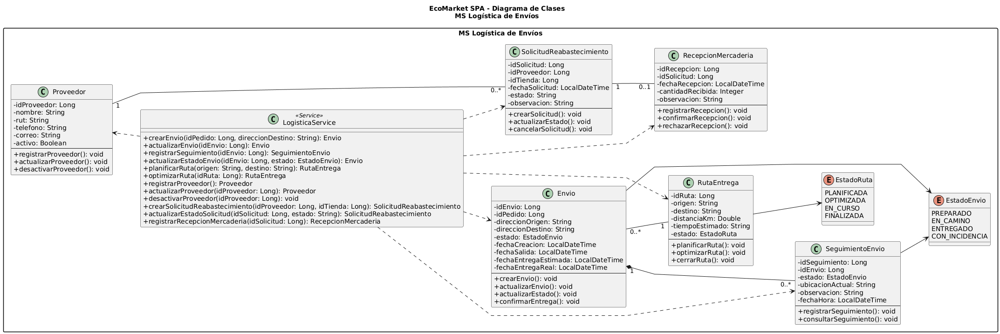

# MS Logistica de Envios

Microservicio responsable de gestionar envios, rutas de entrega, proveedores logisticos, seguimiento e incidencias asociadas al despacho de pedidos de EcoMarket SPA.

## Responsable

| Campo | Detalle |
| --- | --- |
| Responsable principal | Benjamín Espinoza |
| Rama de trabajo | `feature/ms-logistica-envios` |
| Base de datos | `bd_logistica` |
| Puerto local | `8087` |
| URL base local | `http://localhost:8087` |

## Que hace

- Crea y administra envios asociados a pedidos.
- Consulta envios por ID o por pedido.
- Cambia estados de envio.
- Registra incidencias durante el despacho.
- Consulta seguimiento de envios.
- Administra proveedores logisticos.
- Crea, actualiza y cambia estados de rutas de entrega.
- Expone respuestas REST con validaciones, manejo de errores y enlaces HATEOAS.

## Tecnologias

- Java 21
- Spring Boot
- Spring Web
- Spring Data JPA / Hibernate
- Spring HATEOAS
- MySQL
- Maven
- JUnit

## Configuracion

El archivo principal de configuracion esta en:

```text
src/main/resources/application.properties
```

Valores principales:

```properties
server.port=8087
spring.datasource.url=jdbc:mysql://localhost:3306/bd_logistica?createDatabaseIfNotExist=true&useSSL=false&serverTimezone=UTC
spring.datasource.username=root
spring.datasource.password=
```

Antes de ejecutar, crear o verificar la base de datos:

```sql
CREATE DATABASE IF NOT EXISTS bd_logistica
CHARACTER SET utf8mb4
COLLATE utf8mb4_unicode_ci;
```

## Como ejecutar

Desde la raiz del repositorio:

```powershell
cd .\ms-logistica-envios\
.\mvnw.cmd spring-boot:run
```

## Como probar

```powershell
.\mvnw.cmd test
```

O desde la raiz:

```powershell
mvn -f ms-logistica-envios/pom.xml clean test
```

## Endpoints principales

| Metodo | Ruta | Uso |
| --- | --- | --- |
| POST | `/api/envios` | Crear envio |
| GET | `/api/envios` | Listar envios |
| GET | `/api/envios/{id}` | Consultar envio |
| PUT | `/api/envios/{id}` | Actualizar envio |
| DELETE | `/api/envios/{id}` | Eliminar envio |
| GET | `/api/envios/pedido/{idPedido}` | Consultar envios por pedido |
| PATCH | `/api/envios/{id}/estado` | Cambiar estado de envio |
| PATCH | `/api/envios/{id}/incidencia` | Registrar incidencia |
| GET | `/api/envios/{id}/seguimiento` | Consultar seguimiento |
| POST | `/api/envios/proveedores` | Crear proveedor |
| GET | `/api/envios/proveedores` | Listar proveedores |
| GET | `/api/envios/proveedores/activos` | Listar proveedores activos |
| GET | `/api/envios/proveedores/buscar` | Buscar proveedores |
| PATCH | `/api/envios/proveedores/{id}/activar` | Activar proveedor |
| PATCH | `/api/envios/proveedores/{id}/desactivar` | Desactivar proveedor |
| POST | `/api/rutas` | Crear ruta de entrega |
| GET | `/api/rutas` | Listar rutas |
| GET | `/api/rutas/{id}` | Consultar ruta |
| PUT | `/api/rutas/{id}` | Actualizar ruta |
| PATCH | `/api/rutas/{id}/estado` | Cambiar estado de ruta |

## Ejemplo de uso

Consultar envios:

```http
GET http://localhost:8087/api/envios
```

Consultar seguimiento:

```http
GET http://localhost:8087/api/envios/1/seguimiento
```

## Diagramas

### Casos de uso



### Diagrama de clases



## Documentacion relacionada

- `../docs/postman/evidencia-logistica-catalogo-sprint3.md`
- `../docs/evidencias-tecnicas/01b_auditoria_sprint3_codigo_hu_tareas.md`
- `../docs/aspectos-eticos-proyecto.md`
- `../docs/evidencias/evidencia-build-tests.md`
- `../docs/arquitectura/bases-datos-mysql.md`
