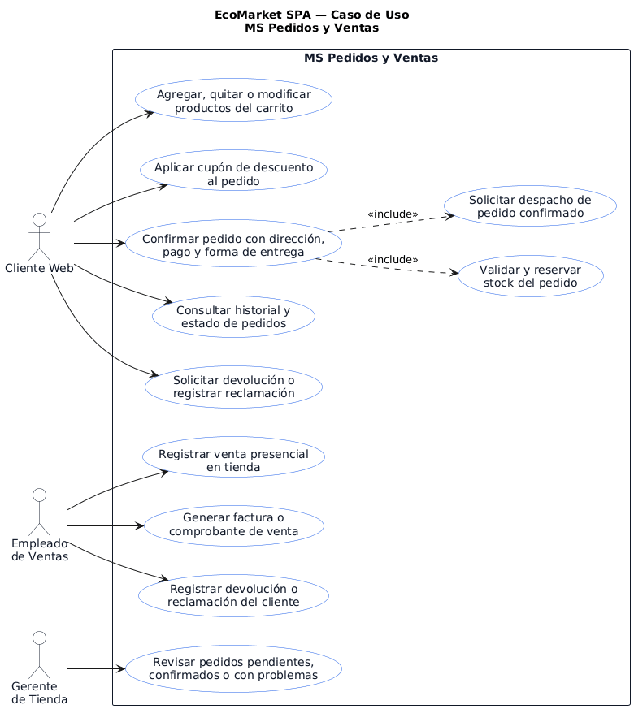
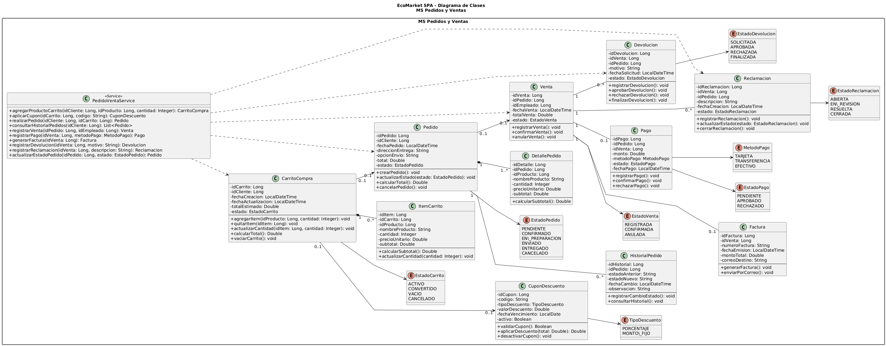

# MS Pedidos y Ventas

Microservicio responsable del flujo comercial de EcoMarket SPA: carrito, pedidos, ventas presenciales, pagos, facturas, cupones, devoluciones y reclamaciones.

## Responsable

| Campo | Detalle |
| --- | --- |
| Responsable principal | Benjamín Flores |
| Rama de trabajo | `feature/ms-pedidos-ventas` |
| Base de datos | `bd_ventas` |
| Puerto local | `8086` |
| URL base local | `http://localhost:8086` |

## Que hace

- Administra carritos de compra y sus items.
- Aplica cupones de descuento.
- Crea pedidos desde carrito.
- Consulta estado e historial de pedidos.
- Registra ventas presenciales.
- Genera facturas asociadas a ventas.
- Gestiona devoluciones y reclamaciones.
- Expone respuestas REST con validaciones, manejo de errores y enlaces HATEOAS.

## Tecnologias

- Java 21
- Spring Boot
- Spring Web
- Spring Data JPA / Hibernate
- Spring HATEOAS
- MySQL
- Maven
- JUnit

## Configuracion

El archivo principal de configuracion esta en:

```text
src/main/resources/application.properties
```

Valores principales:

```properties
spring.application.name=ms-pedidos-ventas
server.port=8086
spring.datasource.url=${VENTAS_DB_URL:jdbc:mysql://localhost:3306/bd_ventas?createDatabaseIfNotExist=true&useSSL=false&allowPublicKeyRetrieval=true&serverTimezone=America/Santiago}
spring.datasource.username=${DB_USER:root}
spring.datasource.password=${DB_PASSWORD:}
```

Antes de ejecutar, crear o verificar la base de datos:

```sql
CREATE DATABASE IF NOT EXISTS bd_ventas
CHARACTER SET utf8mb4
COLLATE utf8mb4_unicode_ci;
```

## Como ejecutar

Desde la raiz del repositorio:

```powershell
cd .\ms-pedidos-ventas\
.\mvnw.cmd spring-boot:run
```

## Como probar

```powershell
.\mvnw.cmd test
```

O desde la raiz:

```powershell
mvn -f ms-pedidos-ventas/pom.xml clean test
```

## Endpoints principales

| Metodo | Ruta | Uso |
| --- | --- | --- |
| POST | `/api/pedidos/carritos` | Crear carrito |
| GET | `/api/pedidos/carritos` | Listar carritos |
| GET | `/api/pedidos/carritos/{idCarrito}` | Consultar carrito |
| POST | `/api/pedidos/carritos/{idCarrito}/items` | Agregar item al carrito |
| PUT | `/api/pedidos/carritos/{idCarrito}/items/{idItem}` | Actualizar cantidad |
| DELETE | `/api/pedidos/carritos/{idCarrito}/items/{idItem}` | Eliminar item |
| POST | `/api/pedidos/carritos/{idCarrito}/cupon` | Aplicar cupon |
| POST | `/api/pedidos/desde-carrito/{idCarrito}` | Crear pedido desde carrito |
| GET | `/api/pedidos` | Listar pedidos |
| GET | `/api/pedidos/{idPedido}` | Consultar pedido |
| GET | `/api/pedidos/{idPedido}/estado` | Consultar estado |
| GET | `/api/pedidos/clientes/{idCliente}/historial` | Historial de cliente |
| PATCH | `/api/pedidos/{idPedido}/cancelar` | Cancelar pedido |
| POST | `/api/ventas/presencial` | Registrar venta presencial |
| GET | `/api/ventas` | Listar ventas |
| GET | `/api/ventas/{idVenta}` | Consultar venta |
| POST | `/api/ventas/{idVenta}/factura` | Generar factura |
| POST | `/api/ventas/{idVenta}/devoluciones` | Registrar devolucion |
| PATCH | `/api/devoluciones/{id}/estado` | Actualizar estado de devolucion |
| POST | `/api/reclamaciones` | Registrar reclamacion |
| PATCH | `/api/reclamaciones/{id}/estado` | Actualizar estado de reclamacion |
| POST | `/api/pedidos/cupones` | Crear cupon |

## Ejemplo de uso

Crear pedido desde carrito:

```http
POST http://localhost:8086/api/pedidos/desde-carrito/1
```

Consultar historial de cliente:

```http
GET http://localhost:8086/api/pedidos/clientes/1/historial
```

## Diagramas

### Casos de uso



### Diagrama de clases



## Documentacion relacionada

- `../docs/pedidos-ventas/flujo-comercial-facturacion-electronica.md`
- `../docs/postman/evidencia-s4-benjamin-flores.md`
- `../docs/evidencias-tecnicas/01c_auditoria_sprint2_codigo_hu_tareas.md`
- `../docs/evidencias-tecnicas/01b_auditoria_sprint3_codigo_hu_tareas.md`
- `../docs/evidencias/evidencia-build-tests.md`
