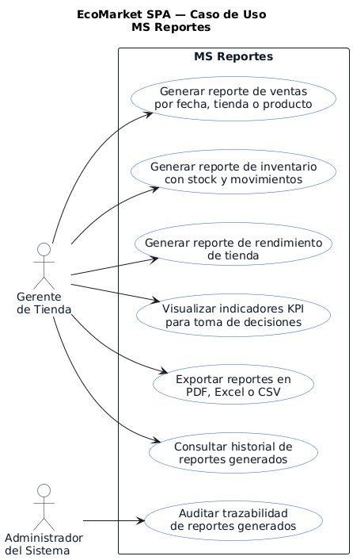
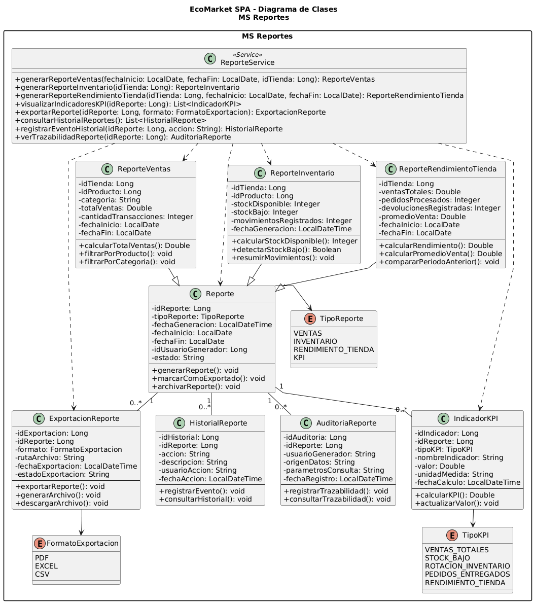

# MS Reportes

Microservicio responsable de generar reportes, indicadores KPI, exportaciones e informacion de auditoria para apoyar la toma de decisiones de EcoMarket SPA.

## Responsable

| Campo | Detalle |
| --- | --- |
| Responsable principal | Benjamín Palma |
| Rama de trabajo | `feature/ms-reportes` |
| Base de datos | `bd_reportes` |
| Puerto local | `8089` |
| URL base local | `http://localhost:8089` |

## Que hace

- Crea, lista, consulta y elimina reportes.
- Genera reportes de ventas.
- Genera reportes de inventario por tienda.
- Genera reportes de rendimiento de tienda.
- Administra indicadores KPI.
- Permite consultar reportes por tipo o tienda.
- Prepara informacion para exportacion y auditoria.
- Expone respuestas REST con validaciones, manejo de errores y enlaces HATEOAS.

## Tecnologias

- Java 21
- Spring Boot
- Spring Web
- Spring Data JPA / Hibernate
- Spring HATEOAS
- MySQL
- Maven
- JUnit

## Configuracion

El archivo principal de configuracion esta en:

```text
src/main/resources/application.properties
```

Valores principales:

```properties
spring.application.name=ms-reportes
server.port=8089
spring.datasource.url=${REPORTES_DB_URL:jdbc:mysql://localhost:3306/bd_reportes?createDatabaseIfNotExist=true&useSSL=false&allowPublicKeyRetrieval=true&serverTimezone=America/Santiago}
spring.datasource.username=${DB_USER:root}
spring.datasource.password=${DB_PASSWORD:}
```

Antes de ejecutar, crear o verificar la base de datos:

```sql
CREATE DATABASE IF NOT EXISTS bd_reportes
CHARACTER SET utf8mb4
COLLATE utf8mb4_unicode_ci;
```

## Como ejecutar

Desde la raiz del repositorio:

```powershell
cd .\ms-reportes\
.\mvnw.cmd spring-boot:run
```

## Como probar

```powershell
.\mvnw.cmd test
```

O desde la raiz:

```powershell
mvn -f ms-reportes/pom.xml clean test
```

## Endpoints principales

| Metodo | Ruta | Uso |
| --- | --- | --- |
| GET | `/api/v1/reportes` | Listar reportes |
| GET | `/api/v1/reportes/{id}` | Consultar reporte |
| POST | `/api/v1/reportes` | Crear reporte |
| DELETE | `/api/v1/reportes/{id}` | Eliminar reporte |
| GET | `/api/v1/reportes/tipo/{tipo}` | Buscar reportes por tipo |
| GET | `/api/v1/reportes/tienda/{idTienda}` | Buscar reportes por tienda |
| POST | `/api/v1/reportes/ventas` | Generar reporte de ventas |
| POST | `/api/v1/reportes/inventario/{idTienda}` | Generar reporte de inventario |
| POST | `/api/v1/reportes/rendimiento` | Generar reporte de rendimiento |
| GET | `/api/v1/kpis` | Listar KPIs |
| GET | `/api/v1/kpis/{id}` | Consultar KPI |
| POST | `/api/v1/kpis` | Crear KPI |
| DELETE | `/api/v1/kpis/{id}` | Eliminar KPI |
| GET | `/api/v1/kpis/tipo/{tipo}` | Buscar KPIs por tipo |

## Ejemplo de uso

Listar reportes:

```http
GET http://localhost:8089/api/v1/reportes
```

Generar reporte de inventario:

```http
POST http://localhost:8089/api/v1/reportes/inventario/1
```

## Diagramas

### Casos de uso



### Diagrama de clases



## Documentacion relacionada

- `../docs/evidencias-tecnicas/01_jira_sprints_epicas_hu.md`
- `../docs/evidencias-tecnicas/01b_auditoria_sprint3_codigo_hu_tareas.md`
- `../docs/evidencias/evidencia-build-tests.md`
- `../docs/arquitectura/bases-datos-mysql.md`
- `../docs/hateoas/documentacion-hateoas-base.md`
