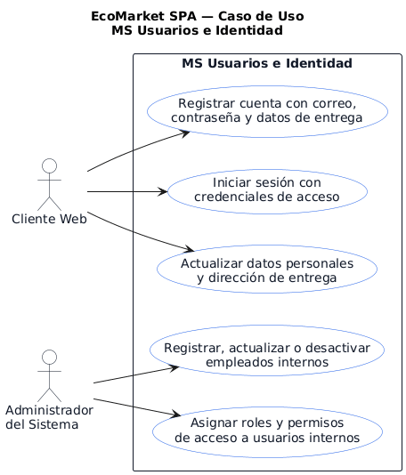
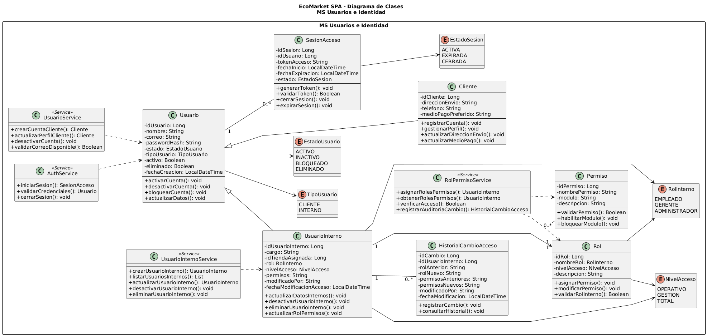

# MS Usuarios e Identidad

Microservicio responsable del registro de clientes, autenticacion, actualizacion de perfil, gestion de usuarios internos y asignacion de roles/permisos dentro de EcoMarket SPA.

## Responsable

| Campo | Detalle |
| --- | --- |
| Responsable principal | Ignacio Valeria |
| Rama de trabajo | `feature/ms-usuarios-identidad` |
| Base de datos | `bd_usuarios` |
| Puerto local | `8083` |
| URL base local | `http://localhost:8083` |

## Que hace

- Registra cuentas de clientes web.
- Permite iniciar sesion con credenciales.
- Permite consultar y actualizar el perfil de cliente.
- Administra usuarios internos del sistema.
- Asigna roles, permisos y niveles de acceso.
- Expone respuestas REST con validaciones, manejo de errores y enlaces HATEOAS.

## Tecnologias

- Java 21
- Spring Boot
- Spring Web
- Spring Data JPA / Hibernate
- Spring HATEOAS
- MySQL
- Maven
- JUnit

## Estructura CSR

- `controller`: expone endpoints REST y respuestas HATEOAS.
- `service`: concentra reglas de negocio y validaciones del dominio.
- `repository`: encapsula el acceso a datos con Spring Data JPA.
- `model`: contiene las clases persistentes JPA (`@Entity`, `@Table`, `@Id`).
- `dto`: define contratos de entrada y salida de la API.

## Configuracion

El archivo principal de configuracion esta en:

```text
src/main/resources/application.properties
```

Valores principales:

```properties
spring.application.name=ms-usuarios-identidad
server.port=8083
spring.datasource.url=${USUARIOS_DB_URL:jdbc:mysql://localhost:3306/bd_usuarios?createDatabaseIfNotExist=true&useSSL=false&allowPublicKeyRetrieval=true&serverTimezone=America/Santiago}
spring.datasource.username=${DB_USER:root}
spring.datasource.password=${DB_PASSWORD:}
```

Antes de ejecutar, crear o verificar la base de datos:

```sql
CREATE DATABASE IF NOT EXISTS bd_usuarios
CHARACTER SET utf8mb4
COLLATE utf8mb4_unicode_ci;
```

## Como ejecutar

Desde la raiz del repositorio:

```powershell
cd .\ms-usuarios-identidad\
.\mvnw.cmd spring-boot:run
```

## Como probar

```powershell
.\mvnw.cmd test
```

O desde la raiz:

```powershell
mvn -f ms-usuarios-identidad/pom.xml clean test
```

## Endpoints principales

| Metodo | Ruta | Uso |
| --- | --- | --- |
| POST | `/api/usuarios/registro` | Registrar cliente web |
| GET | `/api/usuarios/clientes/{idCliente}/perfil` | Consultar perfil de cliente |
| PUT | `/api/usuarios/clientes/{idCliente}/perfil` | Actualizar perfil, direccion y medio de pago |
| POST | `/api/auth/login` | Iniciar sesion |
| POST | `/api/usuarios/internos` | Crear usuario interno |
| GET | `/api/usuarios/internos` | Listar usuarios internos |
| PUT | `/api/usuarios/internos/{id}` | Actualizar usuario interno |
| PUT | `/api/usuarios/internos/{id}/desactivar` | Desactivar usuario interno |
| DELETE | `/api/usuarios/internos/{id}` | Eliminar usuario interno |
| PUT | `/api/usuarios/internos/{id}/roles-permisos` | Asignar roles y permisos |
| GET | `/api/usuarios/internos/{id}/roles-permisos` | Consultar roles y permisos |
| GET | `/api/usuarios/internos/{id}/verificar-acceso` | Verificar acceso a un modulo |

## Ejemplo de uso

Registrar un cliente:

```http
POST http://localhost:8083/api/usuarios/registro
Content-Type: application/json
```

Consultar perfil:

```http
GET http://localhost:8083/api/usuarios/clientes/1/perfil
```

## Diagramas

### Casos de uso



### Diagrama de clases



## Documentacion relacionada

- `../docs/postman/evidencia-s4-ignacio-usuarios.md`
- `../docs/evidencias-tecnicas/03_postman_endpoints.md`
- `../docs/evidencias-tecnicas/05_rest_crud_hateoas.md`
- `../docs/arquitectura/bases-datos-mysql.md`
- `../docs/hateoas/documentacion-hateoas-base.md`
